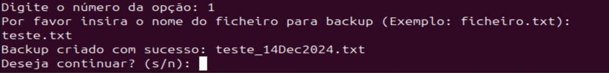
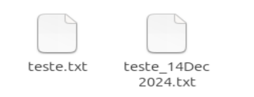

# TRSI_Projeto_2024_2025
Repositório para o projeto da disciplina de Tecnologias de Scripting e Automação

## Testes do Código numa Máquina Linux

As imagens a seguir mostram todos os testes realizados para verificar a funcionalidade total do código em um ambiente Linux (Ubuntu).   
Cada imagem representa uma etapa do processo de teste, desde a execução das opções no menu até os resultados obtidos no terminal, demonstrando que o código funciona corretamente no sistema.

### Sistema Detetado

### Opção 1 no Menu

### Opção 2 no Menu

### Opção 3 no Menu

### Opção 4 no Menu

### Opção 5 no Menu

### Opção 6 no Menu

### Opção 7 no Menu

### Opção 8 no Menu

### Opção 9 no Menu
